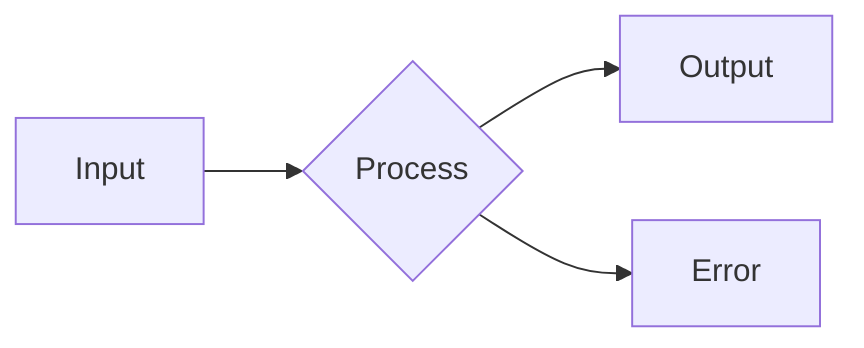

# MkDocs

*Written: 2026-08-23*

## Overview

MkDocs is a static site generator designed for building project documentation. Combined with the Material for MkDocs theme, it provides a modern, responsive documentation site with minimal configuration.

| Aspect | Detail |
|--------|--------|
| Language | Python |
| Config | `mkdocs.yml` (YAML) |
| Content | Markdown files |
| Theme | Material for MkDocs (recommended) |
| Deployment | GitHub Pages, GitLab Pages, Netlify, S3 |

---

## Installation

```bash
# Install MkDocs + Material theme
pip install mkdocs-material

# Verify installation
mkdocs --version
```

---

## Project Structure

```
project/
├── mkdocs.yml              # Configuration file
├── docs/
│   ├── index.md            # Homepage
│   ├── section/
│   │   ├── index.md        # Section landing page
│   │   ├── page-1.md       # Content page
│   │   └── page-2.md
│   ├── css/
│   │   └── extra.css       # Custom styles
│   └── overrides/          # Theme overrides
│       └── main.html
└── site/                   # Generated output (git-ignored)
```

---

## Essential Commands

| Command | Purpose |
|---------|---------|
| `mkdocs serve` | Live preview at localhost:8000 (auto-reload) |
| `mkdocs build` | Generate static site in `site/` directory |
| `mkdocs gh-deploy` | Build + deploy to GitHub Pages |
| `mkdocs new project` | Scaffold new project |

---

## mkdocs.yml Configuration

### Minimal Setup

```yaml
site_name: My Documentation
site_url: https://username.github.io/repo

theme:
  name: material
  palette:
    - scheme: default
      toggle:
        icon: material/brightness-7
    - scheme: slate
      toggle:
        icon: material/brightness-4
  features:
    - navigation.tabs
    - navigation.top
    - content.code.copy
    - search.highlight

markdown_extensions:
  - admonition
  - pymdownx.details
  - pymdownx.superfences
  - pymdownx.highlight:
      anchor_linenums: true
  - pymdownx.tabbed:
      alternate_style: true
  - attr_list
  - toc:
      permalink: true

nav:
  - Home: index.md
  - Section:
      - Page 1: section/page-1.md
      - Page 2: section/page-2.md
```

---

## Material Theme Features

### Navigation

| Feature | Effect |
|---------|--------|
| `navigation.tabs` | Top-level sections as tab bar |
| `navigation.tabs.sticky` | Tabs visible on scroll |
| `navigation.expand` | Expand all nav sections by default |
| `navigation.top` | "Back to top" button |
| `navigation.footer` | Previous/next page links |
| `navigation.indexes` | Section index pages |
| `toc.follow` | TOC follows scroll position |

### Content

| Feature | Effect |
|---------|--------|
| `content.code.copy` | Copy button on code blocks |
| `content.code.annotate` | Code annotations (numbered comments) |
| `content.tabs.link` | Linked tabs (switch all at once) |
| `search.suggest` | Search autocomplete |
| `search.highlight` | Highlight search terms on page |

---

## Markdown Extensions

### Admonitions

```markdown
!!! note "Title"
    Content inside the admonition.

!!! warning
    Default title is the type name.

??? tip "Collapsible"
    Content hidden until clicked.
```

Types: `note`, `abstract`, `info`, `tip`, `success`, `question`, `warning`, `failure`, `danger`, `bug`, `example`, `quote`

### Code Blocks

````markdown
```python title="example.py" linenums="1" hl_lines="2 3"
def hello():
    name = "world"       # (1)!
    return f"Hello, {name}"
```

1. This is a code annotation!
````

### Tabbed Content

```markdown
=== "Python"
    ```python
    print("Hello")
    ```

=== "Rust"
    ```rust
    println!("Hello");
    ```
```

### Mermaid Diagrams

````markdown

````

---

## Deployment to GitHub Pages

### Using GitHub Actions

```yaml
# .github/workflows/docs.yml
name: Deploy docs
on:
  push:
    branches: [main]

permissions:
  contents: write

jobs:
  deploy:
    runs-on: ubuntu-latest
    steps:
      - uses: actions/checkout@v4
      - uses: actions/setup-python@v5
        with:
          python-version: '3.12'
      - run: pip install mkdocs-material
      - run: mkdocs gh-deploy --force
```

### Manual Deploy

```bash
mkdocs gh-deploy
# Builds site and pushes to gh-pages branch
```

---

## Useful Plugins

| Plugin | Purpose | Install |
|--------|---------|---------|
| `search` | Built-in search | Included |
| `tags` | Tag pages, tag index | Included with Material |
| `blog` | Blog-style posts with dates | Material Insiders |
| `social` | Auto-generate social cards | Material Insiders |
| `optimize` | Compress images | Material Insiders |
| `privacy` | Self-host external assets | Material Insiders |
| `mkdocstrings` | Auto-generate API docs from docstrings | `pip install mkdocstrings` |
| `git-revision-date-localized` | Show last edit date | Separate package |
| `minify` | Minify HTML/JS/CSS | Separate package |

---

## Custom CSS

```css
/* docs/css/extra.css */

/* Custom admonition colors */
:root {
    --md-admonition-icon--tip: url('data:image/svg+xml,...');
}

/* Wider content area */
.md-grid {
    max-width: 1440px;
}

/* Custom code block styling */
.highlight code {
    font-size: 0.85em;
}
```

Reference in mkdocs.yml:

```yaml
extra_css:
  - css/extra.css
```

---

## Tips

| Tip | How |
|-----|-----|
| Live reload | `mkdocs serve --dirtyreload` (faster, partial rebuild) |
| Strict mode | `mkdocs build --strict` (fail on warnings) |
| Custom 404 | Create `docs/404.md` |
| Page metadata | YAML frontmatter (`title`, `description`, `tags`) |
| Hide navigation | Frontmatter: `hide: [navigation, toc]` |
| Link to heading | `[text](#heading-slug)` or `[text](page.md#heading)` |
| Image with caption | Use `<figure>` with `md_in_html` extension |
