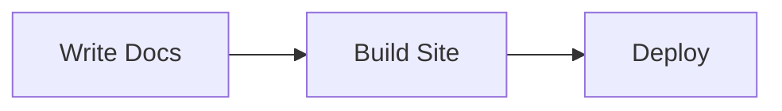

# MkDocs Guide

A comprehensive guide to building documentation sites with [MkDocs](https://www.mkdocs.org/) and the [Material for MkDocs](https://squidfunk.github.io/mkdocs-material/) theme.

## Installation

```bash
# Install MkDocs and Material theme
pip install mkdocs mkdocs-material

# Verify installation
mkdocs --version

# Create a new project
mkdocs new my-docs
cd my-docs
```

### Recommended extras

```bash
pip install mkdocs-material[imaging]   # Social cards, image optimization
pip install mkdocs-minify-plugin       # Minify HTML output
pip install mkdocs-redirects           # Handle URL changes gracefully
pip install mkdocs-git-revision-date-localized-plugin  # Show last edit dates
```

## Project Structure

```
my-docs/
├── docs/
│   ├── index.md              # Homepage
│   ├── about/
│   │   └── index.md
│   ├── guides/
│   │   ├── index.md
│   │   └── quickstart.md
│   └── assets/
│       ├── images/
│       └── stylesheets/
│           └── extra.css     # Custom styles
├── overrides/                # Theme template overrides
│   └── main.html
├── mkdocs.yml                # Configuration file
└── requirements.txt          # Pin your doc dependencies
```

| Path | Purpose |
|------|---------|
| `docs/` | All markdown content lives here |
| `docs/assets/` | Images, CSS, JS — anything static |
| `overrides/` | Jinja2 templates to extend Material theme |
| `mkdocs.yml` | Single source of truth for site config |

## Configuration (mkdocs.yml)

### Minimal working config

```yaml
site_name: My Documentation
site_url: https://username.github.io/repo-name
repo_url: https://github.com/username/repo-name

theme:
  name: material
```

### Full-featured config

```yaml
site_name: Bruce Wen's Knowledge Base
site_url: https://wenijinew.github.io
repo_url: https://github.com/wenijinew/wenijinew.github.io
edit_uri: edit/main/docs/

theme:
  name: material
  language: en
  palette:
    - scheme: default
      primary: indigo
      accent: amber
      toggle:
        icon: material/brightness-7
        name: Switch to dark mode
    - scheme: slate
      primary: indigo
      accent: amber
      toggle:
        icon: material/brightness-4
        name: Switch to light mode
  features:
    - navigation.tabs           # Top-level sections as tabs
    - navigation.sections       # Render sections as groups in sidebar
    - navigation.expand         # Expand all collapsible sections
    - navigation.top            # Back-to-top button
    - navigation.instant        # SPA-like navigation (no full reload)
    - search.suggest            # Autocomplete in search
    - search.highlight          # Highlight matches on target page
    - content.code.copy         # Copy button on code blocks
    - content.code.annotate     # Inline code annotations
    - toc.integrate             # Table of contents in left sidebar

nav:
  - Home: index.md
  - Guides:
      - guides/index.md
      - guides/quickstart.md
  - About: about/index.md

plugins:
  - search
  - minify:
      minify_html: true
  - git-revision-date-localized:
      enable_creation_date: true

extra_css:
  - assets/stylesheets/extra.css
```

## Material Theme Features

### Admonitions (callout boxes)

```markdown
!!! note "Title here"
    Content inside the admonition.

!!! warning
    This is a warning without a custom title.

!!! tip inline end
    Inline admonitions float beside content.
```

Available types: `note`, `abstract`, `info`, `tip`, `success`, `question`, `warning`, `failure`, `danger`, `bug`, `example`, `quote`.

### Code blocks with features

````markdown
```python title="example.py" linenums="1" hl_lines="2 3"
def greet(name: str) -> str:
    """Return a greeting."""
    return f"Hello, {name}!"
```
````

### Content tabs

```markdown
=== "Python"
    ```python
    print("Hello")
    ```

=== "Bash"
    ```bash
    echo "Hello"
    ```
```

### Diagrams with Mermaid

````markdown

````

## Markdown Extensions

Add to `mkdocs.yml`:

```yaml
markdown_extensions:
  - admonition                   # Callout boxes
  - pymdownx.details             # Collapsible admonitions
  - pymdownx.superfences:        # Fenced code blocks, Mermaid
      custom_fences:
        - name: mermaid
          class: mermaid
          format: !!python/name:pymdownx.superfences.fence_code_format
  - pymdownx.tabbed:             # Content tabs
      alternate_style: true
  - pymdownx.highlight:          # Code highlighting
      anchor_linenums: true
  - pymdownx.inlinehilite        # Inline code highlighting
  - pymdownx.snippets            # Include external files
  - pymdownx.arithmatex:         # LaTeX math
      generic: true
  - attr_list                    # Add HTML attributes to elements
  - md_in_html                   # Markdown inside HTML blocks
  - tables                       # Standard tables
  - toc:
      permalink: true            # Anchor links on headings
```

## Deployment to GitHub Pages

### Option 1: GitHub Actions (recommended)

Create `.github/workflows/docs.yml`:

```yaml
name: Deploy Docs
on:
  push:
    branches: [main]

permissions:
  contents: write

jobs:
  deploy:
    runs-on: ubuntu-latest
    steps:
      - uses: actions/checkout@v4
        with:
          fetch-depth: 0      # Needed for git-revision-date plugin

      - uses: actions/setup-python@v5
        with:
          python-version: '3.12'

      - run: pip install mkdocs-material mkdocs-minify-plugin

      - run: mkdocs gh-deploy --force
```

### Option 2: Manual deploy

```bash
# Build and push to gh-pages branch
mkdocs gh-deploy

# Or build only (output in site/)
mkdocs build
```

### GitHub repo settings

1. Go to **Settings → Pages**
2. Set source to **Deploy from a branch**
3. Select branch: `gh-pages` / `/ (root)`

## Useful Plugins

| Plugin | Purpose | Install |
|--------|---------|---------|
| `mkdocs-material` | Feature-rich theme | `pip install mkdocs-material` |
| `mkdocs-minify-plugin` | Minify HTML/JS/CSS | `pip install mkdocs-minify-plugin` |
| `mkdocs-git-revision-date-localized-plugin` | Last-updated dates | `pip install mkdocs-git-revision-date-localized-plugin` |
| `mkdocs-redirects` | URL redirects | `pip install mkdocs-redirects` |
| `mkdocs-macros-plugin` | Jinja2 macros in markdown | `pip install mkdocs-macros-plugin` |
| `mkdocs-glightbox` | Image lightbox (zoom) | `pip install mkdocs-glightbox` |
| `mkdocs-awesome-pages-plugin` | Auto-generate nav | `pip install mkdocs-awesome-pages-plugin` |

## Local Development

```bash
# Live-reload server (watches for changes)
mkdocs serve

# Serve on a specific port
mkdocs serve -a localhost:9000

# Build without deploying (check for warnings)
mkdocs build --strict
```

## Tips

- Use `--strict` in CI to catch broken links and missing references
- Put large images in `docs/assets/images/` and reference with relative paths
- Use `nav:` in `mkdocs.yml` to control page order explicitly — without it, MkDocs sorts alphabetically
- Add `extra.social` in config for footer social links
- Override templates in `overrides/` for custom headers, footers, or analytics
- Pin your dependencies in `requirements.txt` to avoid surprise breakage

---

*Last updated: 2026-08-23*
